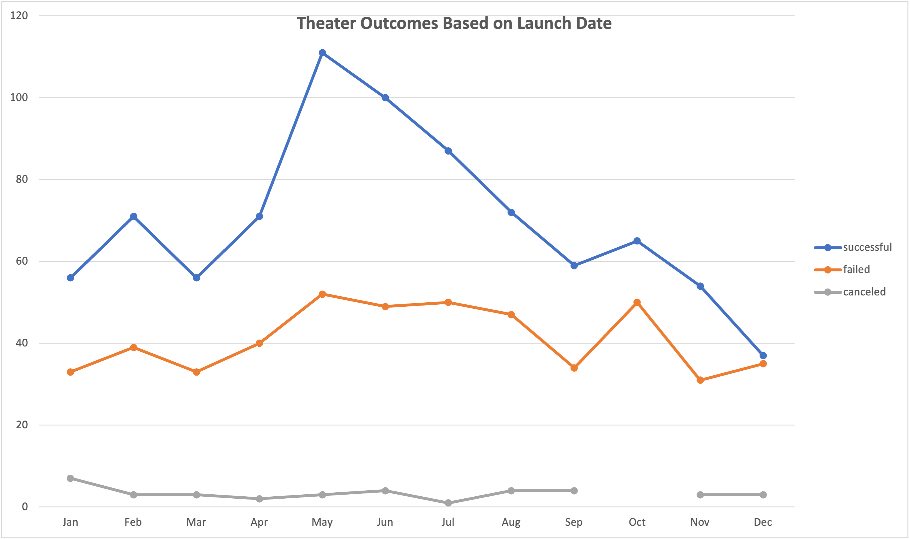

# Kickstarter Campaign Analysis

## Overview of Project

[TODO: Explain the purpose of this analysis]
Performing analysis on Kickstarter data to uncover trends.

---

## Analysis and Challenges
[TODO: Explain how you performed your analysis using images and links to code, as well as any challenges you encountered and how you overcame them. If you had no challenges, describe any possible challenges or difficulties that could be encountered.]

### Performance Analysis
[TODO: Explain how you performed your analysis using images and links to code]

### Analysis of Outcomes Based on Launch Date
[TODO: Explain out this analysis was performed and include code or other images if they can help.]

---

### Analysis of Outcomes Based on Goals

---

### Challenges and Difficulties Encountered
I had a few challenges to work around in order to get the desired results.

1. To start, I had the wrong data after completing the modules.  Most likely this was due to some editing I did that either overwritten data or removed it.  After starting with a new download of Kickstarter data and running through the modules again the line chart for Outcomes Based on Launch Date macthed.

2. In module [TODO x.x.x], the table for the Descriptive Statistics tab was correct for the Goals and for the mean, median and standard deviation of pledged amounts, however, the Quartiles were off by a small margin.  After comparing data with the original sheet for quite a while, I noticed I forgot to use the .EXC function of the Quartile function to exclude the median of the dataset when calculating Q1 and Q3. 

I am still new to excel so I need to understand this better still but it makes sense that before I excluded the mean the final values were only off slightly and once I did exclude it the values matched the exercise exactly. Later, I noticed this was specified but in a rush to redo the modules I missed this syntax.

3: For Deliverable 2, I ran into a couple of issues.
  - At first I was not getting the correct data for the inital pivot table to create the correct line chart.  In the end, I forgot to add the condition to check for only "plays". Once I added this condition to each of the cells, the data matched perfectly.
  - I could not figure out how to get the labels at the bottom to match without having "sum of ..." preceding the label and thouhgt I was putting the data in the wrong section of the pivot table.  I thought I needed to put the percentages in the column section but that did not show up right.  When I put them in the Sum area, the table looked correct but it would not allow me to edit the names because the table already had a column named w/o "sum of ...".  In google, someone suggested adding a space to the name and this worked great.  

[TODO question]I hope that is ok because the chart looks like the example in the challenge but to me, the sum of something has a different meaning than the individual but I suppose there is only one sum per row? I am not sure of this answer so it may be something I will understand once I get a better handle on data modeling.

---

## Results

- What are two conclusions you can draw about the Outcomes based on Launch Date?

- What can you conclude about the Outcomes based on Goals?

- What are some limitations of this dataset?

- What are some other possible tables and/or graphs that we could create?

