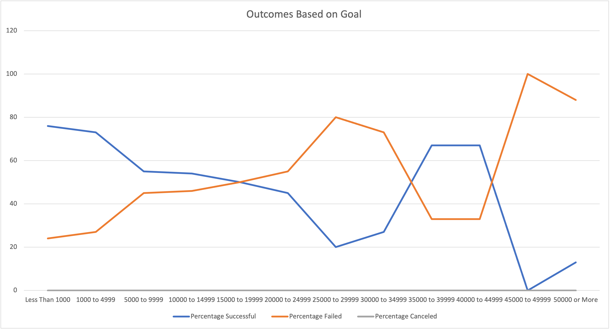

# Kickstarter Campaign Analysis

## Overview of Project

Louise is an upcoming playwright that wants to start a fundraising campaign to fund her play, "Fever". Her budget is estimated to be around $12K and she would like more information about what she can do to ensure her campaign will be successful.

This analysis will attempt to sift through thousands of previous fundraising campaigns to determine what makes a successful campaign.  We will include charts and tables to show trends in the data to present the data in a comprehensible format.

---

## Analysis and Challenges

### Analysis of Outcomes Based on Launch Date
This analysis was performed by pulling data from Kickstarter sheet. Before creating the new Pivot table and Chart, a column was added to pull out the year that each fundraiser was launched. This will allow Louise to filter on both the year of the launch and the fundraising category. Since Louise is only interested in plays, she can focus on just theater fundraisers to determine what time of year would be best to launch the fundraiser for "Fever".

Each fundraiser is grouped by the month they were launched. The graph below shows that May and June are the most successful month to launch fundraisers!  Once June has passed, the likelihood of a fundraiser being successful drops significantly. Most likely this is due to people being busy with finishing up the school year and focusing on summer activities.  During the summer it is much more difficult to consistently reach out to people that are on vacation.

If we filter through specific years we can drill down a bit to find a few successful campaigns.  For example, in 2011 there were 2 in Dec. Since this is outside the range of May and June an investigation can be done to see what may be different about these campaigns that could have made them more successful.
- From the Kickstarter page, filter the columns "outcomes" by "successful", "Category" by "theater", and "Years" by 2011. This will show the fundraising data for 4 plays that year.  The 2 fundraisers in Dec. were for "Waxing: A New Play" and "A Thought in Three Parts".
- Data for Waxing shows the following: The goal was relatively low at 1.5K and had 52 backers.  With that many backers the average donation was around $38. Since the goal was surpassed many donations could have been less and the goal would have still been achieved.
- Data for A Thought in Paris shows the following: This goal was slighly higher at 7K but still low compared to 12K which Louise needs. This play was also able to round up 151 backers with an average donation of $47 each which is not too extravagant.  It could also be the case that 2011 was a good year for plays in Dec.
- We would need more data to determine why those plays in particular were of interest to donars and since there were only 4 plays that were successful that month, it probably would not pay to run the fundraiser at that time anyway.
- Continuing to go through the years we can see there were some other times that were successful but if we cannot find more than 5 plays in a different time of year it is probably not worth investigating any further.
- 2014 looks like it was a popular year for several theater campaigns. Let's see if we can find some more info for that year instead. Looking at the graph, it looks like the best months for fundraising that year were May, June and Oct and averaged around 50 projects. Let's see if we can find more about the fundraisers those months.
-  Going back to the Kickstarter page leaving the filters from above except changing the year to 2104 and adding the filter "Subcategory" = "plays". Since we already know that May and June are good fundraising month, what made October 2014 different? Sorting on goals we can quickly see that most successful campaigns in Oct. 2014 were less than 10K. this would not be a good time for Louise to start the campaign. Setting the months to "May" and "June", we can see that most campaigns were also less than 10K so 2014 may be too far back to use so granualarly.
-  Using 2015, we can see there are quite a few successful campaigns in May and June that year as well. Though there are more sucessful campaigns at 10K and up in 2015 than others it is still insignifigant considering the number of plays during May and June were 74 and only 6 campaigns were over 10K.

---

### Analysis of Outcomes Based on Goals
This analysis was performed by setting up specific ranges of funding goals for the "plays" subcategory within the "theater" parent category.  To do this, a new worksheet was added showing the break down of goals in ranges of $5,000.  Anything goal less than $1,000 or greater than $50,000 were included as separate goals to include all goals at the upper and lower ranges.

To get the total numbers within each range, the COUNTIFS function was used as follows:
  =COUNTIFS(Kickstarter!F:F, "successful", Kickstarter!R:R,"plays", Kickstarter!$D:$D, "<1000")
In this example, the data was pulled from the Kickstarter table then added to the total if the outcome is "successful", the subcategory is a "play" and the goal is in the range specified. In this case, any goal less than $1,000 will be included. This function was then used for both failed and canceled outcomes to fill those columns. 

The rest of the table includes the Total number of projects and the percentage of "succesful", "failed" and "canceled" plays for each goal range.  The total used the SUM function and the percentages were calculated using the ROUND function to divide each outcome by the total number of projects in each range.

Here is an image of the table created which will be referenced below when describing what was found from the pivot table and line chart:

Once this table was created, this smaller dataset was used to create a Pivot Table and Line Chart to only reflect the percentages for each outcome based on the goal ranges.

---

### Challenges and Difficulties Encountered
I had a few challenges to work around in order to get the desired results.

- To start, I had the wrong data after completing the modules.  Most likely this was due to some editing I did that either overwritten data or removed it.  After starting with a new download of Kickstarter data and running through the modules again the line chart for Outcomes Based on Launch Date macthed.

- In module 1.5.2 Measures of Spread, the table for the Descriptive Statistics tab was correct for the Goals and for the mean, median and standard deviation of pledged amounts, however, the Quartiles were off only for the Pledged cells by a small margin.  After comparing data with the original sheet for quite a while, I noticed I forgot to use the .EXC part of the Quartile function.

I am still new to excel and it has been a long time since I took statistics so I need to understand this better still but it makes sense that before I excluded data the values were only off slightly. Once I did exclude it, the values matched the exercise exactly. Later, I noticed this was specified but in a rush to redo the modules I missed this part of the function.

For Deliverable 2, I ran into a couple of issues.

  - At first I was not getting the correct data for the inital pivot table to create the correct line chart.  In the end, I forgot to add the condition to check for only "plays". Once I added this condition to each of the cells, the data matched perfectly.
  
  - I could not figure out how to get the labels at the bottom to match without having "sum of ..." preceding the label and thouhgt I was putting the data in the wrong section of the pivot table.  I thought I needed to put the percentages in the column section but that did not show up right.  When I put them in the Sum area, the table looked correct but it would not allow me to edit the names because the table already had a column named w/o "sum of ...".  In google, someone suggested adding a space to the name which worked.

---

## Results

- What are two conclusions you can draw about the Outcomes based on Launch Date?

   - Though May and June are the most successful months for a campaign, most campaigns during those months were less that 10K. This does not bode well for Louise's campaign at $12K.

   - Though there were some years that had successful compaigns in Oct or Dec. there was not enough data to make a conclusion as to why and investigating these months was unsuccessful in revealing anything new.

   - Without more data it is difficult to advise Louise on what efforts she can make to be in the range of successful plays with a funding goal over 10K. For example, the following information may be useful:
       - More information about each donar.  How did they donate? Are they subscribers to some list? Do they frequent plays more than others for some reason? 
       - What type of effort was made for each campaign. For example, how many advertisements went out? What social media platforms were used and which ones brought in the most pledges?
       - Who raised the most money each year? Were they staff members? If so, what is their background in fundrasining and is this part of their job description? If not, were they volunteers? How do we find and train these volunteers to help them be more successful?

- What can you conclude about the Outcomes based on Goals?

   - From the line chart below we can see the following information:

       - The most successful funding raising efforts were for plays that had a fundraising goal of less than $1000. This is understandable, since it is a very low amount and would need less backers to reach the goal.
       - The least successful projects where in the range of 45,000 to 49,000. This also makes sense as the more money that is needed the harder it will be to find the backers to support it. 
       - However, plays with a goal of greater than $50,000 are shown to be more successful even though this could be a significantly higher goal to reach as it is unlimited.  If we go back to the original table that was used to create this chart we can see that there was only one play with a funding goal in the range of $45-$49K. Since that play failed the success rate would be 0, whereas, even though most plays with a goal over $50K had a lot more failures, it does have 2 that were successful which is enough to show a significant difference in the line chart.
       - Possibly the pivot table would be more informative if it included the total number of projects.
       - In the range of $35K to $44.9K there are quite a few successful projects yet in the ranges just below this level, i.e. $25K to $34.9K there was a high failure rate. There are no significant data in this part of the analyis to indicate why this is the case. There are some data points that may help if they were provided and those are discussed in the analyis of outcomes based on launched date section.
       - Louise has a fundraising goal of $12K.  When we look at plays that are in this range we can see from the graph below that fundraising goals in this range have a success rate of approximately 54%.  This is not bad but there are some factors that could be at work that can make this goal more or less achievable. To do this we will want to investigate other plays in this range that either succeeded or failed and what were the most likely reasons.
       - After anaylysing the data based on Launched Date, it was difficult to determine what made fundraising more or less likely to succeed. It seems as if people are more willing to give more money during the months of May and June but it is unclear why.  See the analysis for Launch date for possible information that could help in this area.

- What are some limitations of this dataset?

   - I discussed most of the limitations in the conclusions above. 
   - I believe the most useful information would be centered around who is donating, why they donate and how do they donate. 
   - Other data about the actual fundraising efforts that were employed would be useful as well.

- What are some other possible tables and/or graphs that we could create?

   - There are probably several different pivot tables that I could add but I am not familiar enough to have time to do it for this assignment. Hopefully, I will get much better at this by the end of this bootcamp!

